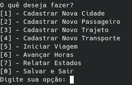

# Projeto de Controle de Viagens

## Visão Geral

Este programa implementa um sistema de gerenciamento de viagens entre cidades, permitindo simular rotas, transporte de passageiros e monitoramento de estados. As principais funcionalidades incluem:

- **Cadastro e gestão de cidades, trajetos e transportes.**
- **Gerenciamento de viagens em andamento, incluindo o descanso de transportes e cálculo de tempo e distância.**
- **Relatórios sobre estados das viagens, passageiros e transportes.**
- **Relatório das 5 cidades mais visitadas.**

## Como Compilar

O projeto pode ser compilado usando o `g++`. Para compilar todo o projeto, siga os passos abaixo:

1. Navegue até o diretório raiz do projeto.
2. Use o comando abaixo no seu emulador de terminal:

    ```
    make
    ```

3. Após a compilação, o binário será gerado e você poderá rodar o programa com:
    ```
    ./main
    ```

4. Após o comando para rodar o prgrama, o conteúdo abaixo irá aparecer. Agora basta digitar o comando necessário e fazer as operações desejadas

    

- OBS: Depois de muitas execuções em sequência, o programa pode apresentar comportamentos estranhos. Em todas as vezes que isso aconteceu, o comando abaixo normalmente os soluciona
    ```
    make clean
    ```

# Como Rodar o Programa
Após compilar, execute o programa com o comando `./main`. A interface do programa permite interagir com as diferentes funcionalidades, como iniciar uma viagem, carregar dados de cidades, passageiros e trajetos, além de gerar relatórios.

# Estrutura de Arquivos
O programa possui 4 dieretórios principais: *classes*, *headers*, *leituraEscrita* e *memory*.

- *classes*: Armazena os `.cpp` das classes Cidade, Controlador, Passageiro, Rota, Trajeto, Transporte e Viagem;
- *headers*: Armazena os `.h` das classes Cidade, Controlador, Passageiro, Rota, Trajeto, Transporte e Viagem;
- *leituraEscrita*: As classes Cidade, Passageiro, Trajeto, Transporte e Viagem precisam ser guardadas na memória para que o programa execute corretamente. Com isso, o diretório atual guarda as classes que fazem essas operações de leitura e escrita da memória.
- *memory*: Guarda as modificações feitas nas classes em seus respectivos arquivos.

# Limitações Conhecidas
- Persistência de Dados: O sistema grava as viagens, trajetos, transportes e cidades em arquivos de texto. No entanto, como os endereços de memória não são confiáveis entre diferentes execuções, o sistema resolve isso reatribuindo as viagens a partir dos dados lidos.
- Escalabilidade: O programa foi desenvolvido para um número limitado de cidades, transportes e passageiros. Em um cenário com muitos dados, a eficiência pode ser comprometida.
- Manuseio de Indireções: O sistema trata viagens indiretas entre cidades, mas ainda depende da ordem correta de leitura e carregamento dos dados para garantir a continuidade das viagens.
- Interface Textual: A interação com o programa é feita via terminal, o que pode ser limitado para usuários menos experientes.

# Melhorias Futuras
- Otimização de busca em grandes vetores: Melhorias no algoritmo de busca por trajetos e cidades.
- Interface Gráfica: Adicionar uma interface mais amigável para interação.
- Persistência aprimorada: Mecanismo mais eficiente para gerenciar dados entre diferentes execuções.

# Contribuição
Este projeto está aberto para contribuições. Sinta-se à vontade para enviar sugestões, correções ou melhorias!